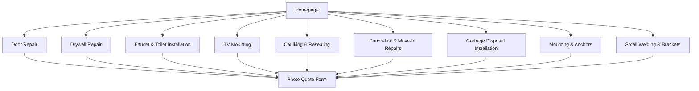

# Handyman Grant Service Architecture and Google Ads Research Report

## Executive summary

The strongest move for Handyman Grant is not a cosmetic rewrite. It is a structural repositioning: stop presenting the business as a broad, reassurance-heavy general handyman brand and instead present it as a **small-job, problem-specific repair service** for clearly bounded work under $1,000. The live homepage currently mixes a wide service spread—welding, fencing, plumbing specialties, GFCI electrical work, mounting, drywall, doors/furniture, and caulking—with heavy trust/safety language. That broad mix is useful for credibility, but it is also likely to pull mismatched leads and low-intent “do you do everything?” traffic instead of higher-intent, scoped repair jobs. citeturn10search0

There is also a compliance issue that should be corrected before scaling paid traffic. The live welding page says “Licensed and fully insured,” while the live homepage footer says “Handyman services ≤ $1,000 total. No permit-required work. Insured.” California law now allows an unlicensed person to advertise only for projects under $1,000, and the advertisement must state that the person is not licensed under the chapter. Separately, the project exemption in Business and Professions Code section 7048 applies only when the aggregate price is under $1,000, the work does not require a permit, and another person is not employed to perform or assist in the work. citeturn10search0turn10search1turn23search6turn23search0

For Google Ads, the safest and highest-performing structure is one landing page per service, one tightly themed ad group per service, and at least two responsive search ads per ad group. Google’s current guidance for responsive search ads emphasizes using up to 15 headlines and 4 descriptions, keeping assets unique and keyword-relevant, and using separate final URLs for separate intents. Google also prohibits gimmicky punctuation/capitalization, phone numbers in ad text, and misleading claims or offers you cannot actually deliver. citeturn21search0turn21search1turn3search6turn19search2turn8search2

The revised service set below keeps the nine core services you prioritized, but it narrows scope where needed. The biggest strategic change is that **Small Welding/Brackets should be tightly constrained to non-structural small fabrication and repairs**. The live welding page currently advertises full fence sections, structural welding, and “Licensed,” which is much riskier for an under-$1,000 unlicensed handyperson positioning. citeturn10search1turn23search0turn23search6

## Research basis and compliance findings

The live site already contains the raw material for a high-intent version of the business. It shows San Diego service geography, small-job pricing cues, photo-based quoting, and service categories including drywall, doors, faucet installs, mounting, and caulking. Those are exactly the kinds of services that can be turned into focused landing pages and tightly themed search campaigns. The homepage also states “Most small jobs: $175–$425,” “Service call minimum: $95,” “No permit-required work,” and “Projects ≤ $1,000 total,” which gives a usable pricing and scope frame for the revised offers. citeturn10search0

The problem is that the current messaging also reaches into higher-risk contractor territory. The homepage speaks to “plumbing specialties,” “mainline repairs,” and “GFCI electrical” work, while the welding page promotes “structural welding for decks, stairs, and patio covers” and says “Licensed and fully insured.” Those claims can create both legal exposure and ad-policy risk if the business is in fact uninsured-but-unlicensed handyperson work only, or if the business does not hold the licenses the page language implies. Google’s misrepresentation policy explicitly prohibits offering services you do not have the right licenses or qualifications to deliver. citeturn10search0turn10search1turn8search2

California’s current primary source rules are much clearer than they were before 2025. Business and Professions Code section 7027.2 now says an unlicensed person may advertise for construction work only if the aggregate contract price is under $1,000 and the advertisement states that the person is not licensed under the chapter. Business and Professions Code section 7048 says the exemption for minor work applies only when the aggregate contract price is under $1,000, the work does not require a building permit, and the person does not employ another person to perform or assist in the work. citeturn23search6turn23search0

For Google Ads execution, three policy points matter most here. First, responsive search ads support up to 15 headlines and 4 descriptions, and Google recommends multiple unique assets per ad group. Second, editorial policy bars phone numbers in ad text and bars gimmicky punctuation, repetition, or capitalization. Third, required or legally important text should be pinned to a stable position if it must always appear. citeturn21search0turn3search6turn19search2turn19search7turn7search2

For landing pages and images, Google’s destination and image requirements also matter. Ad destinations must work, be accessible to Google AdsBot, and match the offer that the ad implies. Image assets should be high quality, easy to understand, service-focused, free of text overlays and collages, and not mostly blank space; Google recommends keeping the important subject matter within the center safe area. citeturn9search1turn9search2turn7search0turn7search2turn7search4turn7search5

## Revised service architecture

The right architecture is a homepage that routes people by problem, not a homepage that tries to close every job type itself. The homepage should introduce the small-job value proposition, then immediately send visitors into service-specific pages: Door Repair, Drywall Repair, Faucet & Toilet Installation, TV Mounting, Caulking & Resealing, Punch-List/Move-In Repairs, Garbage Disposal Installation, Mounting & Anchors, and Small Welding/Brackets. This is a cleaner fit with the live site’s existing small-job cues and avoids mixing low-risk repair intent with high-risk contractor-like scopes. citeturn10search0turn10search1turn23search0turn23search6



The table below previews the revised service architecture. The price ranges are **recommended positioning ranges**, not statutory rules; they are aligned to the live site’s small-job pricing cues and the California under-$1,000 cap for the unlicensed-advertising/work exemption. citeturn10search0turn23search0turn23search6

| Service | Slug | Paid-search priority | Recommended price range | Key exclusions |
|---|---|---:|---:|---|
| Door Repair | `door-repair` | Highest | $175–$525 | No reframing, egress changes, new rough openings |
| Drywall Repair | `drywall-repair` | Highest | $195–$650 | No framing, mold remediation, permit work |
| Faucet & Toilet Installation | `faucet-toilet-installation` | Highest | $195–$695 | Like-for-like fixture swaps only; no repipes or relocations |
| TV Mounting | `tv-mounting` | High | $195–$495 | No permitted electrical relocation |
| Caulking & Resealing | `caulking-resealing` | High | $175–$475 | No waterproofing contractor work or structural crack repair |
| Punch-List & Move-In Repairs | `punch-list-move-in-repairs` | High | $225–$950 | Minor bundled fixes only; no remodel scope |
| Garbage Disposal Installation | `garbage-disposal-installation` | Medium-high | $225–$575 | Existing power/plumbing only |
| Mounting & Anchors | `mounting-anchors` | Medium-high | $175–$525 | No structural/life-safety engineering claims |
| Small Welding & Brackets | `small-welding-brackets` | Controlled | $250–$950 | Non-structural only; no decks/stairs/patio covers/full fence sections |

For galleries, use the same four-photo rhythm on every service page: a clear **before/problem shot**, a **context shot** showing location and scale, a **process/detail shot**, and a **finished straight-on after shot**. Google’s image rules favor clear, high-quality, non-collaged, non-overlaid photos with the service itself as the focal point and minimal empty space. citeturn7search0turn7search2turn7search4turn7search5turn7search8

| Service | Recommended gallery sequence |
|---|---|
| Door Repair | Rubbing edge or latch problem; reveal/hinge close-up; adjustment process; finished shut door with even gaps |
| Drywall Repair | Hole/crack close-up; room context; patch/texture stage; paint-ready finish |
| Faucet & Toilet | Existing fixture/problem; under-sink or flange context; clean install stage; finished fixture straight-on |
| TV Mounting | Wall and TV before; stud/anchor prep; level/mount detail; finished cable-managed view |
| Caulking | Failed caulk close-up; full tub/sink/window edge; removal and prep; clean resealed line |
| Punch List | Multi-item before collage should be avoided, so use separate item shots; one work-in-progress shot; completed room overview |
| Disposal | Old disposal / leak / noise context; under-sink plumbing/electrical context; replacement stage; finished under-sink and sink-top view |
| Mounting & Anchors | Item to be mounted; fastener/substrate detail; anchor install stage; finished loaded mount |
| Welding & Brackets | Broken tab/bracket close-up; part context; weld/fabrication stage; finished painted or installed result |

## Keywords and campaign mapping

Google’s search keyword syntax is straightforward: broad match uses plain text, phrase match uses quotation marks, and exact match uses brackets. Negative keywords can also use broad, phrase, or exact matching, but they do **not** match to close variants in the same way positive keywords do, so singular/plural and synonym coverage still matters. Google’s search terms reporting and keyword docs also make clear that broad match can pick up close and semantically related queries, which is useful only after a strong negative-keyword layer is in place. citeturn26search1turn26search0turn26search2turn26search4

At campaign level, use **one campaign per service family**, **one tightly themed ad group per landing page**, and **location targeting set to the actual San Diego service area using “Presence” if you only want physically local users**, with radius/city targeting where appropriate. Google allows radius targeting, but the radius must be at least 1 km. citeturn25search4turn25search6

A strong shared account-level negative list for this business is: `free`, `cheap`, `cheapest`, `diy`, `how to`, `youtube`, `job`, `jobs`, `hiring`, `salary`, `course`, `class`, `training`, `ikea`, `furniture assembly`, `moving`, `movers`, `cleaning`, `maid`, `landscaping`, `roof`, `roofing`, `foundation`, `addition`, `remodel`, `general contractor`, `licensed contractor`, `contractor license`. This reduces informational, employment, and contractor-grade searches, which Google specifically recommends handling through negative keywords when they are similar to your keywords but aimed at a different intent. citeturn26search0

The campaign map below is the recommended starting structure.

| Campaign | Ad group | Landing page | Top 10 keywords |
|---|---|---|---|
| Door Repair | Door Repair | `/door-repair.html` | `[door repair san diego]`, `"door repair san diego"`, `[fix sticking door]`, `"door won't latch"`, `[door won't close]`, `"interior door repair"`, `"exterior door repair"`, `[door hinge repair]`, `"door latch repair"`, `"door alignment repair"` |
| Drywall Repair | Drywall Repair | `/drywall-repair.html` | `[drywall repair san diego]`, `"drywall repair san diego"`, `[hole in wall repair]`, `"drywall patch repair"`, `[ceiling patch repair]`, `"wall crack repair"`, `"anchor hole repair"`, `[drywall patch near me]`, `"small drywall repair"`, `"texture match drywall"` |
| Faucet Toilet | Faucet & Toilet Installation | `/faucet-toilet-installation.html` | `[faucet installation san diego]`, `[toilet installation san diego]`, `"faucet replacement"`, `"toilet replacement"`, `[kitchen faucet install]`, `[bathroom faucet install]`, `"toilet swap"`, `"new toilet install"`, `"fixture installation handyman"`, `"small plumbing fixture install"` |
| TV Mounting | TV Mounting | `/tv-mounting.html` | `[tv mounting san diego]`, `"tv mounting san diego"`, `[tv wall mount install]`, `"above fireplace tv mount"`, `[mount tv on wall]`, `"hide tv wires"`, `"tv bracket install"`, `[large tv mounting]`, `"same day tv mounting"`, `"tv installation handyman"` |
| Caulking | Caulking & Resealing | `/caulking-resealing.html` | `[caulking san diego]`, `"recaulking service"`, `[shower recaulking]`, `"tub caulking repair"`, `[sink resealing]`, `"window caulking service"`, `"bathroom caulking"`, `"remove old caulk"`, `[kitchen sink caulking]`, `"mildew resistant caulk service"` |
| Punch List | Punch-List & Move-In Repairs | `/punch-list-move-in-repairs.html` | `[punch list repairs san diego]`, `"move in repairs"`, `[small home repairs]`, `"handyman punch list"`, `[condo punch list]`, `"rental turnover repairs"`, `"minor repairs one visit"`, `[move out repair help]`, `"multiple small repairs"`, `"new home fix list"` |
| Disposal | Garbage Disposal Installation | `/garbage-disposal-installation.html` | `[garbage disposal installation]`, `"garbage disposal replacement"`, `[disposal install san diego]`, `"new garbage disposal install"`, `[replace kitchen disposal]`, `"leaking disposal replace"`, `"noisy disposal replace"`, `[disposal swap]`, `"under sink disposal install"`, `"existing disposal replacement"` |
| Mounting | Mounting & Anchors | `/mounting-anchors.html` | `[heavy mounting san diego]`, `"wall anchor installation"`, `[shelf mounting]`, `"mirror mounting service"`, `[concrete anchor install]`, `"mount heavy item on wall"`, `[wall bracket install]`, `"secure wall anchors"`, `[equipment mounting]`, `"stud mounting service"` |
| Welding | Small Welding & Brackets | `/small-welding-brackets.html` | `[small welding san diego]`, `"custom bracket welding"`, `[metal bracket repair]`, `"gate tab welding"`, `[small mobile welding]`, `"non structural welding repair"`, `[bracket fabrication]`, `"metal tab repair"`, `[small weld repair]`, `"local small welding"` |

Detailed keyword sets follow. I have separated them into exact, phrase, broad, and negatives so they can be pasted more easily into Google Ads.

**Door Repair**  
Exact: `[door repair san diego]`; `[fix sticking door]`; `[door won't latch]`; `[door won't close]`; `[door hinge repair]`; `[door latch repair]`  
Phrase: `"door repair san diego"`; `"interior door repair"`; `"exterior door repair"`; `"door alignment repair"`; `"door handle repair"`; `"door closer repair"`  
Broad: `door repair`; `sticking door repair`; `interior door fix`; `door latch repair`; `sagging door help`  
Negatives: `garage door`; `automatic door`; `commercial storefront`; `sliding glass replacement`; `car door`; `door manufacturer`; `door supplier`

**Drywall Repair**  
Exact: `[drywall repair san diego]`; `[hole in wall repair]`; `[ceiling patch repair]`; `[anchor hole repair]`; `[small drywall repair]`; `[wall crack repair]`  
Phrase: `"drywall repair san diego"`; `"drywall patch repair"`; `"texture match drywall"`; `"paint ready drywall patch"`; `"ceiling drywall patch"`; `"wall patch service"`  
Broad: `drywall repair`; `wall patch`; `ceiling patch`; `hole repair wall`; `texture patch repair`  
Negatives: `water damage restoration`; `mold remediation`; `insulation`; `framing`; `drywall contractor`; `commercial drywall`; `sheetrock supply`

**Faucet & Toilet Installation**  
Exact: `[faucet installation san diego]`; `[toilet installation san diego]`; `[kitchen faucet install]`; `[bathroom faucet install]`; `[new toilet install]`; `[toilet replacement]`  
Phrase: `"faucet replacement"`; `"toilet replacement"`; `"small plumbing fixture install"`; `"handyman faucet install"`; `"toilet swap"`; `"fixture installation handyman"`  
Broad: `faucet install`; `toilet install`; `fixture replacement`; `bath faucet install`; `kitchen faucet replacement`  
Negatives: `emergency plumber`; `repipe`; `drain cleaning`; `sewer`; `water heater`; `tankless`; `slab leak`; `main line`

**TV Mounting**  
Exact: `[tv mounting san diego]`; `[tv wall mount install]`; `[mount tv on wall]`; `[large tv mounting]`; `[tv bracket install]`; `[above fireplace tv mount]`  
Phrase: `"tv mounting san diego"`; `"hide tv wires"`; `"same day tv mounting"`; `"tv installation handyman"`; `"wall mount tv service"`; `"mount tv above fireplace"`  
Broad: `tv mounting`; `wall mount tv`; `tv install`; `tv bracket help`; `tv wire concealment`  
Negatives: `antenna`; `cable company`; `satellite`; `home theater installation`; `electrician`; `fireplace remodel`; `projector`

**Caulking & Resealing**  
Exact: `[caulking san diego]`; `[shower recaulking]`; `[sink resealing]`; `[bathroom caulking]`; `[kitchen sink caulking]`; `[window caulking service]`  
Phrase: `"recaulking service"`; `"tub caulking repair"`; `"remove old caulk"`; `"mildew resistant caulk service"`; `"bathroom resealing"`; `"shower resealing help"`  
Broad: `recaulking`; `tub caulk repair`; `sink reseal`; `window caulking`; `bathroom caulk replacement`  
Negatives: `roof sealant`; `foundation crack`; `waterproofing contractor`; `concrete crack repair`; `roofing`; `epoxy`

**Punch-List & Move-In Repairs**  
Exact: `[punch list repairs san diego]`; `[small home repairs]`; `[condo punch list]`; `[move out repair help]`; `[new home fix list]`; `[minor repairs one visit]`  
Phrase: `"move in repairs"`; `"handyman punch list"`; `"rental turnover repairs"`; `"multiple small repairs"`; `"one visit handyman"`; `"small repair visit"`  
Broad: `punch list repairs`; `move in repair`; `small home fixes`; `handyman for list`; `minor home repairs`  
Negatives: `remodel contractor`; `home inspection`; `construction punch`; `builder warranty`; `large renovation`; `insurance claim`

**Garbage Disposal Installation**  
Exact: `[garbage disposal installation]`; `[disposal install san diego]`; `[replace kitchen disposal]`; `[disposal swap]`; `[existing disposal replacement]`; `[new garbage disposal install]`  
Phrase: `"garbage disposal replacement"`; `"leaking disposal replace"`; `"noisy disposal replace"`; `"under sink disposal install"`; `"disposal replacement service"`; `"like for like disposal install"`  
Broad: `garbage disposal install`; `disposal replacement`; `kitchen disposal swap`; `new disposal install`; `under sink disposal help`  
Negatives: `drain clog`; `sewer`; `dishwasher repair`; `circuit install`; `electrical upgrade`; `emergency plumber`

**Mounting & Anchors**  
Exact: `[heavy mounting san diego]`; `[shelf mounting]`; `[mirror mounting service]`; `[concrete anchor install]`; `[wall bracket install]`; `[equipment mounting]`  
Phrase: `"wall anchor installation"`; `"mount heavy item on wall"`; `"secure wall anchors"`; `"stud mounting service"`; `"shelf mounting handyman"`; `"mirror mounting handyman"`  
Broad: `heavy wall mounting`; `wall anchor install`; `shelf install wall`; `mirror mount`; `bracket mounting`  
Negatives: `moving company`; `warehouse racking`; `commercial signage`; `gun safe`; `garage storage system`; `overhead lift`

**Small Welding & Brackets**  
Exact: `[small welding san diego]`; `[metal bracket repair]`; `[small weld repair]`; `[bracket fabrication]`; `[gate tab welding]`; `[small mobile welding]`  
Phrase: `"custom bracket welding"`; `"non structural welding repair"`; `"metal tab repair"`; `"local small welding"`; `"small bracket fabrication"`; `"metal bracket welding"`  
Broad: `small welding`; `bracket welding`; `metal repair weld`; `tab repair weld`; `mobile small welding`  
Negatives: `structural welding`; `certified welder`; `aluminum tig`; `trailer repair`; `pipe welding`; `full fence install`; `railing install`; `deck welding`; `stairs welding`

## Google-compliant ad copy and legal language

Google recommends using the full asset set in responsive search ads, and its current RSA guidance supports up to 15 headlines and 4 descriptions. Google editorial policy also bans phone numbers in ad text, gimmicky punctuation, and unsupported or misleading claims. Because California now requires an unlicensed advertiser to state that they are not licensed under the chapter, the cleanest implementation is to **pin Description 1 for every service to** `Not a licensed contractor`. If you need a disclosure to appear consistently, Google’s pinning guidance says to pin it to a stable headline or description position. citeturn21search0turn3search6turn19search2turn23search6turn19search7

All descriptions below are intentionally kept to **30 characters or fewer** because you asked for the stricter limit, even though Google generally allows longer search descriptions. citeturn3search6

**Door Repair**  
Headlines: `Door Repair San Diego` | `Fix Sticking Doors` | `Door Won't Latch` | `Hinge And Latch Repair` | `Interior Door Repair` | `Exterior Door Repair` | `Sagging Door Fixed` | `Door Hardware Repair` | `Same Week Door Repair` | `Door Alignment Help` | `Lockset And Handle Help` | `Door Closer Repair` | `Get A Clear Repair Quote` | `Small Door Repairs` | `Fast Door Adjustments`  
Descriptions: `Not a licensed contractor` | `Photo quote for doors` | `Hinges latches handles` | `Small repairs under $1K`

**Drywall Repair**  
Headlines: `Drywall Repair San Diego` | `Hole In Wall Repair` | `Ceiling Patch Repair` | `Drywall Patch And Blend` | `Texture Match Repairs` | `Paint Ready Wall Patches` | `Crack And Dent Repair` | `Drywall Hole Patching` | `Wall Patch Service` | `Clean Drywall Repairs` | `Same Week Drywall Help` | `Anchor Hole Repair` | `Fast Ceiling Patch Help` | `Smooth Wall Patch Work` | `Small Drywall Jobs`  
Descriptions: `Not a licensed contractor` | `Photo quote for drywall` | `Patches blended cleanly` | `Walls ceilings patch work`

**Faucet & Toilet Installation**  
Headlines: `Faucet Install San Diego` | `Toilet Install San Diego` | `Faucet Replacement Help` | `Toilet Replacement Help` | `Leak Free Faucet Install` | `Toilet Swap And Reset` | `Kitchen Faucet Install` | `Bathroom Faucet Install` | `New Toilet Installed` | `Fixture Swap Service` | `Supply Line Replacements` | `Like For Like Installs` | `Clear Install Pricing` | `Same Week Fixture Help` | `Small Plumbing Swaps`  
Descriptions: `Not a licensed contractor` | `Like for like installs` | `Faucets toilets shutoffs` | `Small installs under $1K`

**TV Mounting**  
Headlines: `TV Mounting San Diego` | `Wall Mount Your TV` | `Large TV Mounting Help` | `Clean TV Wall Mounting` | `Above Fireplace TV Mount` | `Hide TV Wires Cleanly` | `Secure TV Mount Install` | `Same Week TV Mounting` | `TV Bracket Install Help` | `Living Room TV Mount` | `Bedroom TV Mount Help` | `Concrete TV Mount Help` | `Mount And Level Your TV` | `Clear TV Mount Pricing` | `Professional TV Setup`  
Descriptions: `Not a licensed contractor` | `TV mounts cleanly done` | `Photo quote for TV mount` | `Existing outlet use only`

**Caulking & Resealing**  
Headlines: `Caulking San Diego` | `Tub And Shower Caulking` | `Recaulking Service` | `Clean Old Caulk Removal` | `Bathroom Caulk Refresh` | `Kitchen Sink Resealing` | `Window And Trim Caulking` | `Fresh Mildew Resistant Seal` | `Same Week Recaulking` | `Neat Caulk Lines` | `Shower Resealing Help` | `Sink And Tub Sealing` | `Stop Gaps And Cracks` | `Silicone Recaulking Help` | `Clean Sealant Replacement`  
Descriptions: `Not a licensed contractor` | `Remove and replace caulk` | `Bath kitchen windows` | `Clean resealing help`

**Punch-List & Move-In Repairs**  
Headlines: `Punch List Repairs` | `Move In Repair Visit` | `Small Home Repairs Visit` | `One Visit Multiple Fixes` | `Condo Punch List Help` | `Rental Turnover Repairs` | `Move Out Repair Help` | `New Home Fix List` | `Knock Out Small Repairs` | `Hardware Patch Caulk Fixes` | `Photo Based Repair Quote` | `Same Week Punch List` | `Handyman Punch List` | `Minor Repairs One Visit` | `Home Fixes Under $1K`  
Descriptions: `Not a licensed contractor` | `Bundle several fixes` | `Doors drywall caulk more` | `Send your list and photos`

**Garbage Disposal Installation**  
Headlines: `Disposal Install San Diego` | `Garbage Disposal Install` | `Garbage Disposal Swap` | `Disposal Replacement Help` | `New Disposal Installed` | `Leaking Disposal Replace` | `Noisy Disposal Replace` | `Kitchen Disposal Help` | `Same Week Disposal Help` | `Clear Disposal Pricing` | `Like For Like Disposal` | `Under Sink Install Help` | `Fast Disposal Swap` | `Existing Wiring Only` | `Small Kitchen Install`  
Descriptions: `Not a licensed contractor` | `Like for like disposal` | `Existing power and drain` | `Photo quote for disposal`

**Mounting & Anchors**  
Headlines: `Heavy Mounting San Diego` | `Shelf And Mirror Mounting` | `Wall Anchors Installed` | `Concrete Anchor Install` | `Secure Heavy Item Mounting` | `Mount Art Mirrors Shelves` | `Equipment Mounting Help` | `Bracket And Anchor Help` | `Same Week Mounting Help` | `Stud And Masonry Mounting` | `Clear Mounting Pricing` | `Fast Shelf Installation` | `Mirror Mounting Service` | `Wall Bracket Install` | `Wall Anchors Done Right`  
Descriptions: `Not a licensed contractor` | `Shelves mirrors anchors` | `Stud masonry drywall` | `Photo quote for mounting`

**Small Welding & Brackets**  
Headlines: `Small Welding San Diego` | `Custom Bracket Welding` | `Metal Bracket Repair` | `Gate Tab Welding Help` | `On Site Small Welds` | `Bracket Fabrication Help` | `Non Structural Weld Repair` | `Metal Repair And Tabs` | `Small Steel Bracket Work` | `Gate Latch Weld Repair` | `Custom Tabs And Stops` | `Same Week Small Welding` | `Mobile Bracket Repair` | `Fabricate Small Brackets` | `Photo Quote For Welding`  
Descriptions: `Not a licensed contractor` | `Small nonstructural welds` | `Brackets tabs repairs` | `Send photos for quote`

The safest scope language for page bodies and ads is shown below. This wording is designed to keep each offer inside the current California under-$1,000/no-permit/unlicensed-advertising framework and away from Google misrepresentation problems. The biggest immediate cleanup items are removing or rewriting live claims such as “Licensed,” “structural welding,” “mainline repairs,” and “code-aware upgrades that pass inspection” unless they are fully, currently supportable. citeturn23search6turn23search0turn8search2turn10search0turn10search1

| Service | Use this scope language | Avoid this language |
|---|---|---|
| Door Repair | Small door adjustment, latch alignment, hinge repair, hardware swaps, weatherstripping | Framing, egress compliance, new openings, contractor-grade door replacement |
| Drywall Repair | Cosmetic patching, crack repair, texture blend, paint-ready small repairs | Structural repairs, mold remediation, fire-rated assembly claims |
| Faucet & Toilet | Like-for-like fixture replacement on existing rough-ins and shutoffs | Repipes, relocations, sewer work, permit plumbing |
| TV Mounting | Wall mounting, bracket installs, clean layout, existing power only | Electrical relocation, code upgrades, in-wall power claims beyond actual scope |
| Caulking | Remove failed caulk, prep surfaces, reseal tubs, showers, sinks, trim, windows | Waterproofing contractor scope, structural crack repair |
| Punch List | Several small repairs in one visit; finish work, touch-ups, minor install/adjustment tasks | Remodel, turnover construction, contractor supervision |
| Disposal | Like-for-like disposal replacement using existing power and plumbing | New circuits, switch additions, permitted electrical/plumbing changes |
| Mounting & Anchors | Shelves, mirrors, artwork, brackets, anchors in drywall/stud/masonry | Structural anchoring, engineering, life-safety load certification |
| Welding & Brackets | Small non-structural bracket fabrication, tabs, stops, minor detached repairs | Structural welding, decks, stairs, patio covers, full fence sections |

Suggested global footer/legal copy:

> Handyperson services for small jobs under $1,000 total. Not a licensed contractor. No permit-required work. Insured. Serving San Diego.

Suggested quote-form support copy:

> Send photos and a short description of the problem. If the job appears to require a permit, employee labor on covered work, or a licensed contractor, I will let you know before scheduling.

Suggested service-page compliance line near the hero:

> Small jobs only. Not a licensed contractor. No permit-required work.

Suggested call asset note for site implementation:

> If you use Google call assets, keep the business phone number visible as text on the landing page, because Google requires phone numbers in call assets to be verifiable on the site; do not place the phone number inside ad text itself. citeturn17search4turn19search2

## Final services.json

The JSON below assumes a typical schema with the fields you specified and uses `gallery` as an array of `{src, alt, caption}` objects and `faqs` as an array of `{question, answer}` objects. Its scopes are deliberately narrower than some current live-page language so the site aligns with the current California unlicensed advertising rules and with Google’s misrepresentation/editorial policies. citeturn10search0turn10search1turn23search6turn23search0turn8search2

```json
[
  {
    "id": 1,
    "slug": "door-repair",
    "title": "Door Repair",
    "short_description": "Repair sticking, sagging, misaligned, or hard-to-latch interior and exterior doors.",
    "long_description": "Handyman Grant handles small door repairs in San Diego, including hinge adjustment, strike alignment, latch issues, closer replacement, weatherstripping, and hardware swaps. This page is for minor repair work only: no permit-required jobs, no reframing, and no large replacement projects.",
    "features": [
      "Fix doors that stick, rub, sag, or will not latch",
      "Adjust hinges, strike plates, closers, and door hardware",
      "Replace handles, locksets, weatherstripping, and basic trim hardware",
      "Photo-based ballpark quoting for small residential repairs"
    ],
    "exclusions": [
      "No new rough openings or reframing",
      "No fire-door compliance work",
      "No permit-required work",
      "No projects over $1,000 total"
    ],
    "price_range": "$175-$525",
    "gallery": [
      {
        "src": "/images/services/door-repair-before-1.jpg",
        "alt": "Before photo of an interior door rubbing at the top corner",
        "caption": "Before: sticking interior door with uneven reveal and latch misalignment"
      },
      {
        "src": "/images/services/door-repair-detail-1.jpg",
        "alt": "Close-up of hinge and strike plate adjustment on a door repair job",
        "caption": "Detail: hinge and strike plate alignment during repair"
      },
      {
        "src": "/images/services/door-repair-process-1.jpg",
        "alt": "Door hardware being adjusted during a residential repair visit",
        "caption": "Process: hardware tuning and door alignment"
      },
      {
        "src": "/images/services/door-repair-after-1.jpg",
        "alt": "After photo of a repaired interior door closing evenly",
        "caption": "After: clean shut line, even reveal, and smooth latch action"
      }
    ],
    "faqs": [
      {
        "question": "Can you fix a door that will not latch?",
        "answer": "Yes. Common fixes include hinge adjustment, strike plate alignment, latch tuning, and minor planing where appropriate."
      },
      {
        "question": "Do you replace door hardware?",
        "answer": "Yes. Handle sets, locksets, closers, and weatherstripping can usually be swapped during the same visit."
      },
      {
        "question": "Do you install brand-new doors?",
        "answer": "This page is for small repair scope. Full reframing or permit-required door projects are outside scope."
      }
    ],
    "cta_text": "Send photos for a door repair quote",
    "seo_title": "Door Repair San Diego | Small Door Fixes Under $1,000",
    "seo_meta": "Small door repairs in San Diego, including sticking doors, latch fixes, hinge adjustment, hardware swaps, and weatherstripping."
  },
  {
    "id": 2,
    "slug": "drywall-repair",
    "title": "Drywall Repair",
    "short_description": "Patch holes, dents, cracks, and anchor damage with clean, paint-ready drywall repairs.",
    "long_description": "Handyman Grant provides small drywall repair in San Diego for holes, dents, cracks, popped fasteners, anchor damage, and ceiling patches. Repairs are kept clean, tidy, and paint-ready, with texture blending where practical for small residential jobs.",
    "features": [
      "Patch small to medium wall and ceiling damage",
      "Repair anchor holes, dents, cracks, and minor texture damage",
      "Blend texture for paint-ready touch-up jobs",
      "Clean, contained work with photo-based quoting"
    ],
    "exclusions": [
      "No framing or structural repair",
      "No mold remediation or active leak investigation",
      "No permit-required work",
      "No projects over $1,000 total"
    ],
    "price_range": "$195-$650",
    "gallery": [
      {
        "src": "/images/services/drywall-repair-before-1.jpg",
        "alt": "Before photo of a hole in drywall from a pulled anchor",
        "caption": "Before: wall damage from anchor pull-out and impact"
      },
      {
        "src": "/images/services/drywall-repair-detail-1.jpg",
        "alt": "Close-up of drywall patch and compound during repair",
        "caption": "Detail: patching and compound work prior to blending"
      },
      {
        "src": "/images/services/drywall-repair-process-1.jpg",
        "alt": "Texture blending process on a drywall patch",
        "caption": "Process: texture blending for a cleaner finish"
      },
      {
        "src": "/images/services/drywall-repair-after-1.jpg",
        "alt": "After photo of a paint-ready drywall repair on an interior wall",
        "caption": "After: smooth, paint-ready patch with clean edges"
      }
    ],
    "faqs": [
      {
        "question": "Can you match wall texture?",
        "answer": "For many small repairs, yes. Texture blending is included where practical, though exact invisible matching is not always possible without full-wall finishing and paint."
      },
      {
        "question": "Do you repair ceilings too?",
        "answer": "Yes. Small ceiling patches and crack repairs are included if the job is safely within small-job scope."
      },
      {
        "question": "Do you paint after patching?",
        "answer": "Touch-up finishing can be discussed, but this page is primarily for clean, paint-ready repair work."
      }
    ],
    "cta_text": "Send photos for a drywall repair quote",
    "seo_title": "Drywall Repair San Diego | Hole, Crack, and Ceiling Patch Repair",
    "seo_meta": "Drywall repair in San Diego for holes, cracks, anchor damage, dents, and ceiling patches with clean, paint-ready results."
  },
  {
    "id": 3,
    "slug": "faucet-toilet-installation",
    "title": "Faucet & Toilet Installation",
    "short_description": "Like-for-like faucet and toilet replacement on existing connections for small residential jobs.",
    "long_description": "Handyman Grant installs replacement faucets and toilets in San Diego for existing residential setups. Typical scope includes kitchen faucets, bathroom faucets, standard toilet swaps, supply line changes, shutoff checks, and cleanup. This page is for like-for-like fixture replacement only.",
    "features": [
      "Install replacement kitchen and bathroom faucets",
      "Replace standard toilets on existing rough-ins",
      "Swap supply lines, connectors, and basic fixture hardware",
      "Straightforward, photo-based quoting for small fixture jobs"
    ],
    "exclusions": [
      "No repipes or drain relocations",
      "No sewer, slab leak, or emergency plumbing work",
      "No permit-required work",
      "No projects over $1,000 total"
    ],
    "price_range": "$195-$695",
    "gallery": [
      {
        "src": "/images/services/faucet-toilet-before-1.jpg",
        "alt": "Before photo of an older leaking bathroom faucet",
        "caption": "Before: outdated fixture ready for replacement"
      },
      {
        "src": "/images/services/faucet-toilet-detail-1.jpg",
        "alt": "Under-sink view of supply line and shutoff setup during installation",
        "caption": "Detail: shutoff and supply connection check during install"
      },
      {
        "src": "/images/services/faucet-toilet-process-1.jpg",
        "alt": "Toilet replacement process showing removed fixture and prep area",
        "caption": "Process: clean fixture swap on existing connections"
      },
      {
        "src": "/images/services/faucet-toilet-after-1.jpg",
        "alt": "After photo of a cleanly installed modern faucet and toilet",
        "caption": "After: clean, leak-checked fixture replacement"
      }
    ],
    "faqs": [
      {
        "question": "Do you install customer-supplied fixtures?",
        "answer": "Yes. Customer-supplied faucets and toilets are fine as long as the install is a like-for-like replacement and the product is complete."
      },
      {
        "question": "Can you replace shutoff valves too?",
        "answer": "Basic shutoff replacement may be possible on small jobs, but larger plumbing issues or corroded systems may need a licensed plumber."
      },
      {
        "question": "Do you move plumbing lines?",
        "answer": "No. This page is for replacement installs on existing connections, not layout changes or permit work."
      }
    ],
    "cta_text": "Send fixture photos for an install quote",
    "seo_title": "Faucet and Toilet Installation San Diego | Small Fixture Swaps",
    "seo_meta": "Like-for-like faucet and toilet installation in San Diego for existing residential fixtures, supply lines, and standard small-job replacements."
  },
  {
    "id": 4,
    "slug": "tv-mounting",
    "title": "TV Mounting",
    "short_description": "Secure TV wall mounting with clean placement and careful hardware selection.",
    "long_description": "Handyman Grant mounts TVs in San Diego on drywall, studs, masonry, and compatible surfaces using the right hardware for the wall type and screen size. Scope includes bracket installs, leveling, placement guidance, and clean layout for existing power setups.",
    "features": [
      "Mount flat and articulating TV brackets",
      "Install on studs, masonry, and compatible wall assemblies",
      "Level screens and place brackets for a cleaner final layout",
      "Photo-based quoting from wall, TV, and mount photos"
    ],
    "exclusions": [
      "No permit-required electrical work",
      "No major wall reconstruction",
      "No new circuit or panel work",
      "No projects over $1,000 total"
    ],
    "price_range": "$195-$495",
    "gallery": [
      {
        "src": "/images/services/tv-mounting-before-1.jpg",
        "alt": "Before photo of a room with a TV waiting to be wall mounted",
        "caption": "Before: TV and wall layout prior to placement"
      },
      {
        "src": "/images/services/tv-mounting-detail-1.jpg",
        "alt": "Close-up of bracket hardware and stud layout during TV mounting",
        "caption": "Detail: wall hardware and mount alignment"
      },
      {
        "src": "/images/services/tv-mounting-process-1.jpg",
        "alt": "TV bracket being leveled on a wall during installation",
        "caption": "Process: careful mount placement and leveling"
      },
      {
        "src": "/images/services/tv-mounting-after-1.jpg",
        "alt": "After photo of a TV mounted cleanly on a living room wall",
        "caption": "After: secure, level TV mounting with a clean final look"
      }
    ],
    "faqs": [
      {
        "question": "Can you mount large TVs?",
        "answer": "Yes, if the wall and mount setup are appropriate. Send the screen size, wall photos, and mount model if you have it."
      },
      {
        "question": "Do you hide wires?",
        "answer": "Surface management and neat layout guidance are fine. Any electrical work must remain within small-job, no-permit scope."
      },
      {
        "question": "Can you mount on masonry?",
        "answer": "Yes, many masonry and concrete walls are workable with the correct anchors and layout."
      }
    ],
    "cta_text": "Send photos for a TV mounting quote",
    "seo_title": "TV Mounting San Diego | Clean Wall Mount Installation",
    "seo_meta": "TV mounting in San Diego for drywall, stud, and masonry walls with secure brackets, clean placement, and photo-based quoting."
  },
  {
    "id": 5,
    "slug": "caulking-resealing",
    "title": "Caulking & Resealing",
    "short_description": "Remove failed caulk and reseal tubs, showers, sinks, trim, and gaps with neat finishing.",
    "long_description": "Handyman Grant provides small caulking and resealing services in San Diego for tubs, showers, sinks, backsplashes, trim lines, windows, and similar residential gaps. The goal is a clean removal, good prep, and a tidy replacement bead where old caulk has failed or looks rough.",
    "features": [
      "Remove deteriorated or moldy caulk",
      "Reseal tubs, showers, sinks, windows, and trim joints",
      "Use neat, homeowner-friendly finishing for visible lines",
      "Fast quoting from close-up photos of the failed seal"
    ],
    "exclusions": [
      "No structural crack repair",
      "No roofing or exterior waterproofing contractor scope",
      "No permit-required work",
      "No projects over $1,000 total"
    ],
    "price_range": "$175-$475",
    "gallery": [
      {
        "src": "/images/services/caulking-before-1.jpg",
        "alt": "Before photo of cracked and moldy tub caulk",
        "caption": "Before: failed bathroom caulk with visible gaps and staining"
      },
      {
        "src": "/images/services/caulking-detail-1.jpg",
        "alt": "Close-up of prep and removal during recaulking work",
        "caption": "Detail: old caulk removal and surface prep"
      },
      {
        "src": "/images/services/caulking-process-1.jpg",
        "alt": "Fresh sealant being applied along a shower edge",
        "caption": "Process: straight, clean resealing line"
      },
      {
        "src": "/images/services/caulking-after-1.jpg",
        "alt": "After photo of freshly resealed shower and tub edge",
        "caption": "After: neat, clean, refreshed caulk line"
      }
    ],
    "faqs": [
      {
        "question": "Do you remove old caulk first?",
        "answer": "Yes. Proper prep and removal are a big part of getting a cleaner-looking final line and longer-lasting result."
      },
      {
        "question": "What areas do you reseal?",
        "answer": "Common areas include showers, tubs, sinks, vanities, backsplashes, window trim, and similar residential joints."
      },
      {
        "question": "Do you handle waterproofing systems?",
        "answer": "No. This page is for surface-level caulk replacement and small resealing jobs, not contractor-grade waterproofing work."
      }
    ],
    "cta_text": "Send close-up photos for a recaulking quote",
    "seo_title": "Caulking and Resealing San Diego | Tub, Shower, Sink, Window Caulk",
    "seo_meta": "Small caulking and resealing jobs in San Diego for tubs, showers, sinks, trim, and windows with clean prep and neat finish."
  },
  {
    "id": 6,
    "slug": "punch-list-move-in-repairs",
    "title": "Punch-List & Move-In Repairs",
    "short_description": "Bundle several small repairs into one focused visit for move-in, move-out, or general home fixes.",
    "long_description": "Handyman Grant handles punch-list and move-in repair visits in San Diego for homeowners, renters, and landlords who need several small items completed efficiently. Typical jobs include door adjustments, drywall patches, hardware replacement, caulking touch-ups, shelf installs, and other minor finish repairs.",
    "features": [
      "Bundle multiple small repairs into one visit",
      "Great fit for move-in, move-out, rental, and punch-list work",
      "Photo-based estimates from a written item list and pictures",
      "Focused on minor repairs, finish work, and practical fixes"
    ],
    "exclusions": [
      "No large remodel scope",
      "No permit-required work",
      "No contractor supervision or build-out scope",
      "No projects over $1,000 total"
    ],
    "price_range": "$225-$950",
    "gallery": [
      {
        "src": "/images/services/punch-list-before-1.jpg",
        "alt": "Before photo of several minor repair items in a condo",
        "caption": "Before: multiple small repair items needing one-visit attention"
      },
      {
        "src": "/images/services/punch-list-detail-1.jpg",
        "alt": "Close-up of one item on a move-in repair punch list",
        "caption": "Detail: targeted small-repair item from a punch list visit"
      },
      {
        "src": "/images/services/punch-list-process-1.jpg",
        "alt": "Tools and minor finish repairs in progress during a punch list visit",
        "caption": "Process: efficient one-visit workflow for several fixes"
      },
      {
        "src": "/images/services/punch-list-after-1.jpg",
        "alt": "After photo showing a room with multiple small repairs completed",
        "caption": "After: several minor repairs completed in one focused visit"
      }
    ],
    "faqs": [
      {
        "question": "What kinds of items belong on a punch list?",
        "answer": "Good candidates include minor drywall, doors, caulk, hardware swaps, hanging and mounting, trim touch-ups, and other small finish tasks."
      },
      {
        "question": "How do I request a quote?",
        "answer": "Send a written item list and photos of each issue. That makes it much easier to estimate whether the whole visit fits small-job scope."
      },
      {
        "question": "Is this for remodel punch lists?",
        "answer": "No. This page is for practical small repairs and move-in/move-out items, not large construction punch lists."
      }
    ],
    "cta_text": "Send your list and photos for a punch-list quote",
    "seo_title": "Punch List Repairs San Diego | Move-In and Small Home Repair Visits",
    "seo_meta": "Punch-list and move-in repairs in San Diego for doors, drywall, hardware, caulk, mounting, and other small residential fixes."
  },
  {
    "id": 7,
    "slug": "garbage-disposal-installation",
    "title": "Garbage Disposal Installation",
    "short_description": "Replace an existing garbage disposal on current plumbing and power connections.",
    "long_description": "Handyman Grant installs replacement garbage disposals in San Diego for existing under-sink setups. Typical jobs include disposal swaps, reconnecting compatible drain components, checking mounting hardware, and making sure the install is clean and tidy for a standard residential setup.",
    "features": [
      "Like-for-like garbage disposal replacement",
      "Reconnect existing compatible drain and sink hardware",
      "Clean under-sink install for standard residential setups",
      "Fast quoting from under-sink and unit photos"
    ],
    "exclusions": [
      "No new circuit or switch installation",
      "No permit-required electrical or plumbing work",
      "No major drain reconfiguration",
      "No projects over $1,000 total"
    ],
    "price_range": "$225-$575",
    "gallery": [
      {
        "src": "/images/services/disposal-before-1.jpg",
        "alt": "Before photo of an older garbage disposal under a kitchen sink",
        "caption": "Before: worn or failing disposal ready for replacement"
      },
      {
        "src": "/images/services/disposal-detail-1.jpg",
        "alt": "Close-up of sink flange and drain connection on a disposal installation",
        "caption": "Detail: mounting and drain connection setup"
      },
      {
        "src": "/images/services/disposal-process-1.jpg",
        "alt": "Garbage disposal being installed under a sink",
        "caption": "Process: like-for-like disposal replacement on an existing setup"
      },
      {
        "src": "/images/services/disposal-after-1.jpg",
        "alt": "After photo of a cleanly installed garbage disposal under a sink",
        "caption": "After: clean under-sink replacement installation"
      }
    ],
    "faqs": [
      {
        "question": "Do you install customer-supplied disposals?",
        "answer": "Yes, as long as the unit fits the existing setup and the job remains a straightforward replacement."
      },
      {
        "question": "Can you add a new switch or electrical line?",
        "answer": "No. This page is for replacement work on existing compatible power and plumbing connections."
      },
      {
        "question": "What photos should I send?",
        "answer": "Send one photo of the sink basin and one or two clear photos under the sink showing the disposal, outlet, and drain connections."
      }
    ],
    "cta_text": "Send under-sink photos for a disposal quote",
    "seo_title": "Garbage Disposal Installation San Diego | Replacement and Swap Service",
    "seo_meta": "Garbage disposal replacement in San Diego for existing residential kitchens with clean like-for-like installation and photo-based quoting."
  },
  {
    "id": 8,
    "slug": "mounting-anchors",
    "title": "Mounting & Anchors",
    "short_description": "Install shelves, mirrors, brackets, and anchors securely in drywall, stud, masonry, and similar surfaces.",
    "long_description": "Handyman Grant handles small mounting and anchor installation in San Diego for shelves, mirrors, artwork, brackets, and heavy household items. The focus is practical residential mounting with the right fasteners for the wall type and the expected load within normal home-use conditions.",
    "features": [
      "Install shelves, mirrors, artwork, brackets, and equipment mounts",
      "Use anchors matched to drywall, studs, masonry, and similar substrates",
      "Check layout, spacing, height, and final appearance before drilling",
      "Photo-based estimates from wall, item, and hardware photos"
    ],
    "exclusions": [
      "No engineering or structural certification",
      "No large commercial mounting scope",
      "No permit-required work",
      "No projects over $1,000 total"
    ],
    "price_range": "$175-$525",
    "gallery": [
      {
        "src": "/images/services/mounting-before-1.jpg",
        "alt": "Before photo of a wall and items waiting to be mounted",
        "caption": "Before: wall and item placement before layout"
      },
      {
        "src": "/images/services/mounting-detail-1.jpg",
        "alt": "Close-up of anchor hardware selected for a wall mounting job",
        "caption": "Detail: anchor and fastener choice for wall type"
      },
      {
        "src": "/images/services/mounting-process-1.jpg",
        "alt": "Bracket installation process on a residential wall",
        "caption": "Process: careful bracket and anchor placement"
      },
      {
        "src": "/images/services/mounting-after-1.jpg",
        "alt": "After photo of shelves and brackets mounted cleanly on a wall",
        "caption": "After: secure and level finished mounting"
      }
    ],
    "faqs": [
      {
        "question": "Can you mount into masonry or concrete?",
        "answer": "Yes, many concrete and masonry surfaces are workable with the right fasteners and tools."
      },
      {
        "question": "Do you install customer-supplied shelves or mirrors?",
        "answer": "Yes. Send photos of the item, hardware, and wall so the mounting approach can be reviewed before scheduling."
      },
      {
        "question": "Do you certify load ratings?",
        "answer": "No. This page is for practical residential mounting and anchor installation, not engineering certification."
      }
    ],
    "cta_text": "Send wall and item photos for a mounting quote",
    "seo_title": "Mounting and Anchors San Diego | Shelves, Mirrors, Brackets, Heavy Items",
    "seo_meta": "Mounting and anchor installation in San Diego for shelves, mirrors, artwork, brackets, and household items on drywall, studs, or masonry."
  },
  {
    "id": 9,
    "slug": "small-welding-brackets",
    "title": "Small Welding & Brackets",
    "short_description": "Small non-structural welding, tab repair, and bracket fabrication for residential and light-duty repair needs.",
    "long_description": "Handyman Grant offers tightly scoped small welding and bracket work in San Diego for non-structural tabs, stops, brackets, and similar light-duty metal repairs. This service is intentionally limited to small, practical fabrication and repair jobs that fit residential handyperson scope.",
    "features": [
      "Repair small brackets, tabs, stops, and light-duty metal parts",
      "Fabricate simple custom brackets for residential use",
      "Handle minor gate tab and latch support repair where appropriate",
      "Quote from detailed photos and measurements before scheduling"
    ],
    "exclusions": [
      "No structural welding",
      "No decks, stairs, patio covers, or load-bearing safety systems",
      "No full fence sections or major gate fabrication",
      "No permit-required work or projects over $1,000 total"
    ],
    "price_range": "$250-$950",
    "gallery": [
      {
        "src": "/images/services/welding-before-1.jpg",
        "alt": "Before photo of a cracked bracket needing small welding repair",
        "caption": "Before: failed bracket or tab requiring small repair"
      },
      {
        "src": "/images/services/welding-detail-1.jpg",
        "alt": "Close-up of a small tab or bracket prepared for welding",
        "caption": "Detail: small metal part prepared for clean repair"
      },
      {
        "src": "/images/services/welding-process-1.jpg",
        "alt": "Small bracket fabrication or weld repair in progress",
        "caption": "Process: light-duty bracket repair or fabrication"
      },
      {
        "src": "/images/services/welding-after-1.jpg",
        "alt": "After photo of a repaired metal bracket with clean finish",
        "caption": "After: finished small bracket repair ready for use or paint"
      }
    ],
    "faqs": [
      {
        "question": "What kind of welding jobs fit this page?",
        "answer": "Small non-structural brackets, tabs, stops, and similar practical residential repair pieces are the best fit."
      },
      {
        "question": "Do you do structural welding or railing systems?",
        "answer": "No. Structural, engineered, permit-required, or load-bearing safety-system work is outside scope for this service."
      },
      {
        "question": "What should I send for a quote?",
        "answer": "Send close-up photos, a wider context photo, and rough measurements so the size and scope can be reviewed before scheduling."
      }
    ],
    "cta_text": "Send metal part photos for a welding quote",
    "seo_title": "Small Welding and Brackets San Diego | Non-Structural Metal Repair",
    "seo_meta": "Small non-structural welding and bracket repair in San Diego for tabs, stops, and light-duty residential metal fabrication."
  }
]
```